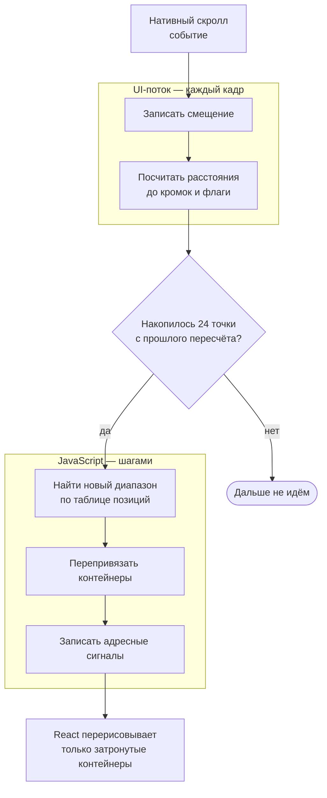
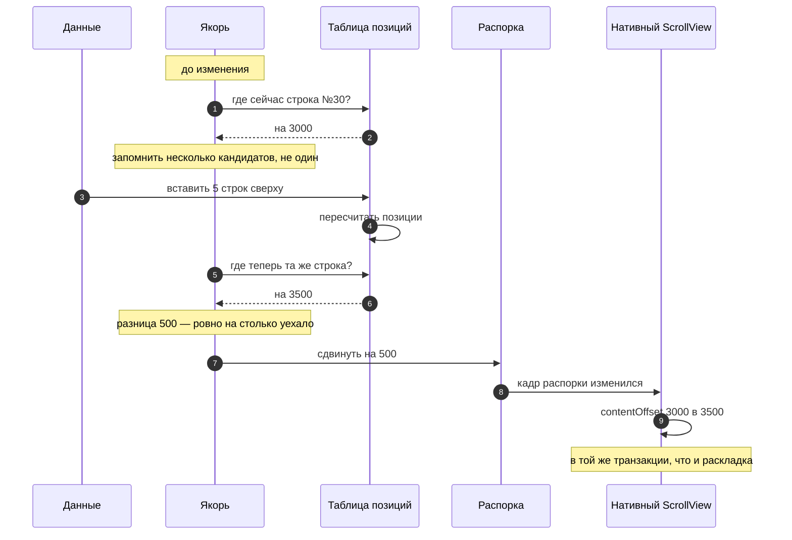
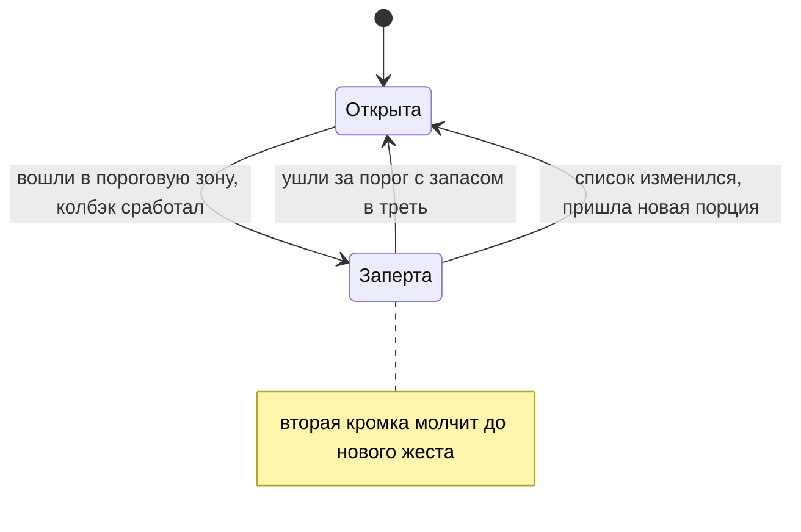
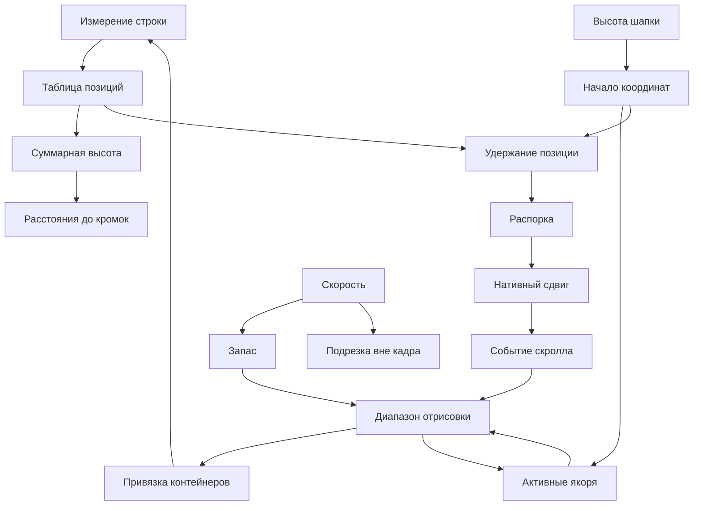

# Механика: как это работает

Устройство списка: что нарисовано на экране, откуда берутся позиции строк, что
происходит при скролле и как удерживается видимая строка. Только схемы и числа,
без кода.

---

## 1. Что нарисовано

Внутри списка — `ScrollView`:

```
┌─ ScrollView ──────────────────────────────────────────┐
│                                                        │
│  ▪ распорка компенсации   высота 0, уведена за контент │
│                                                        │
│  ┌──────────────────────────────────────────────────┐  │
│  │ шапка                          ListHeaderComponent│  │
│  └──────────────────────────────────────────────────┘  │
│                                                        │
│  ┌─ слой контейнеров ───────── высота = сумма высот ─┐  │
│  │                                                   │  │
│  │   ┌─ контейнер #0 ─┐  absolute, top: 1200         │  │
│  │   └────────────────┘                              │  │
│  │   ┌─ контейнер #1 ─┐  absolute, top: 1284         │  │
│  │   └────────────────┘                              │  │
│  │   ┌─ контейнер #2 ─┐  absolute, top: 1404         │  │
│  │   └────────────────┘                              │  │
│  │        … всего 15–20 штук                         │  │
│  └───────────────────────────────────────────────────┘  │
│                                                        │
│  ┌──────────────────────────────────────────────────┐  │
│  │ подвал                         ListFooterComponent│  │
│  └──────────────────────────────────────────────────┘  │
│                                                        │
│  ▪ распорка нижнего отступа            высота insetEnd │
└────────────────────────────────────────────────────────┘
```

**Строк в дереве нет.** Есть контейнеры — столько, сколько помещается в видимую
часть плюс запас.

**Полосу прокрутки создаёт высота слоя.** Слой контейнеров объявляет высоту,
равную сумме высот всех строк. Контейнеры лежат в нём абсолютно и в потоке не
участвуют.

**Контейнер переживает смену строки.** Ушедшая за пределы запаса строка не
размонтируется — её контейнер получает данные другой строки. Свободный контейнер
выбирается по типу строки.

---

## 2. Откуда берутся позиции

Позиция строки — сумма высот всех строк выше неё.

```
строка:    0        1          2      3        4
высота:   84       120        56     92       84
          ├────────┼──────────┼──────┼────────┼────▶
позиция:  0        84        204    260      352
```

Суммы накапливаются заранее и пересчитываются **лениво**: только до запрошенного
индекса и только начиная с места изменения.

### Пока строка не измерена

В таблице стоит **оценка** — средний измеренный размер строк того же типа.
Среднее уточняется с каждым замером и **замирает после 32 замеров**. Оценка,
однажды выданная конкретной строке, задним числом не меняется.

---

## 3. Что происходит при скролле



- **Смещение пишется первым.** Отсюда его читают прилипание и всё покадровое.
- **Расстояния до кромок считаются на UI-потоке** из смещения и размеров
  контента.
- **Порог перехода в JS — по пути:** 24 точки (`scrollThrottleDistance`). У
  кромок контента порог не применяется.
- **Диапазон** — видимая часть плюс запас по 400 точек в каждую сторону.
- **Сигналы адресные:** контейнер без изменений не перерисовывается.

### Запас отрисовки

```
        ┌─────────────────────────────┐
        │  запас 400 — уже смонтирован│  строки успевают измериться
        ├─────────────────────────────┤
        │                             │
        │    В И Д И М А Я  Ч А С Т Ь │
        │                             │
        ├─────────────────────────────┤
        │  запас 400 + скорость × 220мс│  на броске растёт вперёд
        └─────────────────────────────┘
```

Строки запаса смонтированы и измерены до того, как попадут в кадр.

По ходу движения запас растёт со скоростью — примерно на пятую долю секунды пути
вперёд, с потолком в полтора экрана. Назад он не растёт. Выше примерно половины
экрана в миллисекунду запас по скорости снимается совсем.

---

## 4. Что происходит, когда строка измерилась


Высота читается у узла, а не берётся из события раскладки. Пересчёт откладывается
до конца кадра и идёт одним проходом на всю пачку замеров.

### Новая строка не занимает места

Строке, появившейся в данных и ещё не измеренной, отводится слот нулевой высоты,
а нарисована она далеко за пределами контента:

```
        обычная строка              новая, ещё не измеренная
    ┌───────────────────┐         ┌───────────────────┐
    │ слот = 92         │         │ слот = 0          │  раскладка не меняется
    │ нарисовано 92     │         └───────────────────┘
    └───────────────────┘
                                   а нарисована она вот здесь:
                                   ┌───────────────────┐
                                   │ позиция −100 000  │  туда скролл не доходит
                                   │ натуральная высота│  измеряем и ставим на место
                                   └───────────────────┘
```

Если разом появилось больше 32 строк, они размещаются по средним оценкам.

### Строка вне кадра закрыта своими границами

Контейнер, полностью выехавший за видимую часть, получает жёсткую высоту по
отведённому месту и обрезает то, что за неё выходит. Пока список движется,
обрезка снимается с запасом в половину буфера; остановка определяется по
отсутствию событий дольше 120 мс. Строка в кадре не подрезается никогда.

---

## 5. Удержание позиции

### Что происходит

Смещение скролла 3000, сверху подгрузилось пять сообщений по 100 точек.

```
   ДО ВСТАВКИ            БЕЗ КОМПЕНСАЦИИ         С КОМПЕНСАЦИЕЙ
                          позиции +500            позиции +500
                                                  скролл 3000 → 3500

  ┌──────────────┐      ┌──────────────┐        ┌──────────────┐
  │ сообщение 28 │      │ новое 4      │        │ сообщение 28 │
  │ сообщение 29 │      │ новое 5      │        │ сообщение 29 │
▶ │ сообщение 30 │    ▶ │ сообщение 26 │      ▶ │ сообщение 30 │
  │ сообщение 31 │      │ сообщение 27 │        │ сообщение 31 │
  └──────────────┘      └──────────────┘        └──────────────┘
     смотрим сюда        всё уехало вниз          ничего не сдвинулось
                         на пол-экрана
```

### Как сделано

Первым ребёнком контента лежит **распорка нулевого размера**, уведённая за
пределы контента. Нативному `ScrollView` включено его собственное удержание
видимой позиции: он запоминает кадр этой распорки перед транзакцией изменений и
после неё добавляет смещение кадра к `contentOffset`.

Чтобы подвинуть скролл, список двигает распорку. Сдвиг и раскладка попадают в
одну транзакцию, жест и инерция не прерываются. Программный `scrollTo` для этого
не используется.

Величина в распорке **накопительная**: нативный слой смотрит на смещение кадра
между транзакциями.



- **Якорей снимается четыре**, опорой становится первый переживший изменение.
- **Предпочтение** — строкам, целиком лежащим ниже верхней кромки.
- **Считается разница позиций**, а не расстояние до кромки экрана.

### Границы применения

- **Двойная компенсация у конца.** Когда контент стал короче, `ScrollView` сам
  подтягивает смещение к новой границе; эта часть в расчёт не берётся.
- **Упор в границы.** Сдвиг обрезается по границе контента, накопленный остаток
  сбрасывается.
- **Доли точки.** Нативный слой принимает целые точки, остаток меньше точки
  копится до следующего прохода.

### Очередь неподтверждённых сдвигов

```
время ──────────────────────────────────────────────▶

  распорка +500 ──┐
                  │   ┌── событие «я на 3000»  ← устарело, отбрасывается
                  ▼   │
            транзакция│
                  │   │
                  ▼   ▼
       contentOffset 3500 ── событие «я на 3500»  ← подтверждает сдвиг
```

Применённые сдвиги стоят в очереди и снимаются по мере прихода событий с
подходящими позициями. Сдвигов подряд бывает несколько, нативный слой применяет
их по одному.

---

## 6. Прилипание

Якорь останавливается у кромки вьюпорта; строка остаётся на своём месте в
контенте, а смещение прилипания считается на UI-потоке.

```
   1. НЕ ДОЕХАЛ            2. У КРОМКИ             3. ВЫТОЛКНУТ
                                                      следующим

  ┌─────────────┐        ┌═════════════┐        ┌─────────────┐
  │             │        ║ 14 сентября ║ ◀─ кромка ┌───────────┐
  │             │        └═════════════┘        │ │15 сентября│ ◀─ кромка
  │ 14 сентября │        │             │        │ └───────────┘
  │             │        │             │        └─────────────┘
  └─────────────┘

  смещение = 0           смещение растёт        смещение упёрлось
  едет с контентом       компенсирует скролл    едет с контентом
                         п о к а д р о в о
```

**Предел** — точка, где текущий якорь уступает место соседнему. Считается из
геометрии соседей и от позиции скролла не зависит.

### Слой копий поверх списка

Пока элемент стоит у кромки, его рисует отдельный слой снаружи прокручиваемой
области:

```
┌─ экран ────────────────────────┐
│ ┌────────────────────────────┐ │
│ │ 14 сентября                │ │ ◀── слой поверх: не двигается вовсе
│ └────────────────────────────┘ │
│ ┌─ ScrollView ───────────────┐ │
│ │  ░░ 14 сентября ░░         │ │ ◀── копия внутри контента: спрятана,
│ │  сообщение                 │ │     но место для касаний осталось
│ │  сообщение                 │ │
│ └────────────────────────────┘ │
└────────────────────────────────┘
```

- **Прилипший элемент остаётся смонтированным** вне диапазона отрисовки. Соседи
  по набору — тоже.
- **Порядок наложения задан ролью**, а не номером контейнера.

### Координаты

Позиции строк отсчитываются от начала элементов, смещение скролла — от начала
контента. Разница равна высоте шапки, и всё, что переводит одно в другое, её
снимает.

---

## 7. Подгрузка



- Колбэк срабатывает один раз на вход в пороговую зону.
- Защёлка отпирается с запасом примерно в треть порога.
- Защёлка снимается досрочно, если контент вырос или изменилось число элементов.
- На обе кромки один замок: после срабатывания одной вторая молчит до нового
  жеста, разблокирует её направление жеста.
- Распорка у конца в расстояние до кромки не входит.
- Программное движение списка порогов не запускает.

---

## 8. Стартовая позиция

Позиция цели считается по таблице, а до измерения ячеек таблица оценочная,
поэтому доводка идёт попытками:

```
попытка 1   цель на 4200   доскроллили   ▸ измерения пришли, цель уехала на 4460
попытка 2   цель на 4460   доскроллили   ▸ цель уехала на 4510
попытка 3   цель на 4510   доскроллили   ▸ цель не сдвинулась
                                          ▸ показываем список
```

До этого момента список не показан. Готовность — это устоявшаяся цель, измеренное
окно рассчитанного offset вместе с `drawDistance` и совпадение живого нативного
смещения с тем, что просила прошлая попытка. Если размеры не устаканились, показ
завершает страховка по времени.

Тот же механизм отвечает за первый показ вообще: список раскрывается, когда
видимые строки измерены или их размеры объявлены пропом. Во время доводки
относительная компенсация и автоприлипание к концу не запускаются.

---

## 9. Распорки и прилипание к концу

Скролл к концу откладывается на кадр: к этому моменту новый контент разложен и
его высота известна. Жест пользователя за этот кадр отменяет прилипание.

```
  alignItemsAtEnd            anchoredEndSpace

┌──────────────┐          ┌──────────────┐
│░░ распорка ░░│          │ цитата       │ ◀─ поднялась к верхней кромке
│░░░░░░░░░░░░░░│          │ сообщение    │
├──────────────┤          │ сообщение    │
│ сообщение 1  │          ├──────────────┤
│ сообщение 2  │          │░░ распорка ░░│ ◀─ места под ней не хватало,
└──────────────┘          └──────────────┘    добрали распоркой

короткий контент          переход к цитате
прижат к низу             у самого конца
```

---

## 10. Видимость элементов

Два вида порогов:

```
   обычная строка                 крупная карточка

┌─ экран ──────────┐          ┌─ экран ──────────┐
│                  │          │▓▓▓▓▓▓▓▓▓▓▓▓▓▓▓▓▓▓│
│  ▓▓▓▓▓▓▓▓▓▓▓▓▓▓  │          │▓▓▓▓▓▓▓▓▓▓▓▓▓▓▓▓▓▓│
│  ▓▓ 60% строки ▓ │          │▓▓ 100% экрана ▓▓▓│
└──────────────────┘          └──────────────────┘
   ▓▓▓▓▓▓▓▓▓▓▓▓▓▓                ▓▓▓▓▓▓▓▓▓▓▓▓▓▓▓▓
                                 ▓▓▓▓▓▓▓▓▓▓▓▓▓▓▓▓

 доля самого элемента          доля занятого экрана
 itemVisiblePercentThreshold   viewAreaCoveragePercentThreshold
```

Наружу уходят только изменения набора. Выдержка `minimumViewTime` отсекает
элементы, ушедшие раньше её истечения. Каждая пара «условие — колбэк» ведётся
отдельно.

---

## 11. Отступы и клавиатура

До низа экрана дотягиваются четверо, и все считают отступ от одной величины —
`insetEnd`:

```
┌─ экран ─────────────────┐
│                         │
│   сообщения             │  ① контент кончается здесь
│                         │  ② скролл поднимается вместе с клавиатурой
├─────────────────────────┤  ③ индикатор прокрутки живёт в своих координатах
│   панель ввода          │  ④ прилипший якорь нижней кромки встаёт сюда
├─────────────────────────┤
│                         │
│   клавиатура            │
│                         │
└─────────────────────────┘
```

Перекрытие снизу — **максимум** из клавиатуры и безопасной зоны, а не сумма.

Место под панелью ввода отдаёт распорка в конце контента. Контент поднимают
двое, правило одно: **низ контента стоит на верхней кромке панели.** Пока
контента меньше экрана, поднимает сдвиг выравнивания; когда больше — смещение
скролла. На границе они делят подъём: сдвиг доезжает до нуля, остаток добирает
скролл.

Конец контента считается по своим размерам: вместо вошедшей в замер
`contentSize` распорки подставляется текущая.

---

## 12. Два канала наружу

| Значения | На UI-поток | В React |
| --- | --- | --- |
| Смещение, фазы жеста | каждый кадр | — |
| Расстояния и флаги кромок | каждый кадр | шагами по 24 точки |
| Размеры, распорки | на раскладке | на раскладке |
| Скорость, видимый диапазон, якоря | шагами | шагами |
| Цена обновления | ноль рендеров | рендер у подписчика |

Расстояния и флаги считаются на UI-потоке из смещения и геометрии. Видимый
диапазон и активные якоря считаются проходом по таблице позиций, поэтому
непрерывными быть не могут.

Подписка в React адресная — на одно имя значения.

---

## Как механики связаны



Круг компенсации замкнут, поэтому в нём стоят две защиты: очередь
неподтверждённых сдвигов и признак программного движения.

Активные якоря прилипания и строки, ждущие первого измерения, остаются
смонтированными вне диапазона.

---

## Порядок вызовов

- Якорь снимается **до** смены данных и восстанавливается **после**.
- Значения, от которых зависит решение о позиции пользователя, снимаются **до**
  применения изменений.
- Диапазон считается по **живому** смещению UI-потока, а не по смещению из
  обрабатываемого события.
- События скролла сливаются в один проход на кадр; у кромки слияние снимается.

---

## Дальше

- [Архитектура](architecture.md) — те же механики по модулям
- [Удержание позиции](maintain-position.md) — настройки и рецепты
- [Производительность](performance.md) — чем платит каждая механика
- [Ограничения](limitations.md) — чего список не делает
