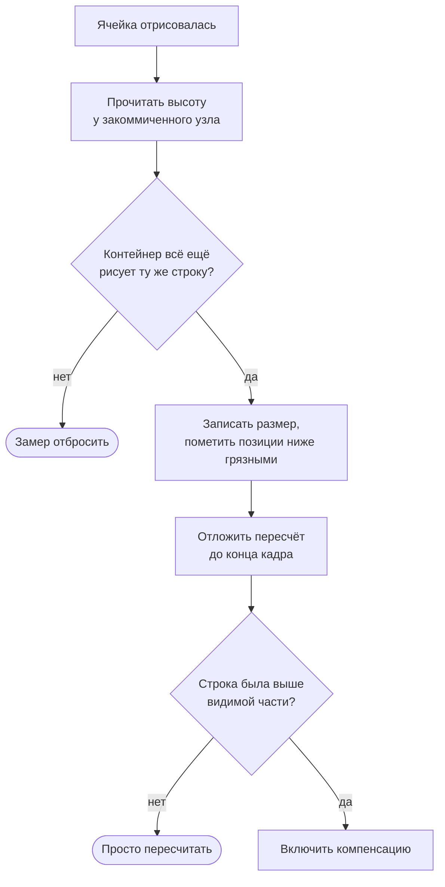
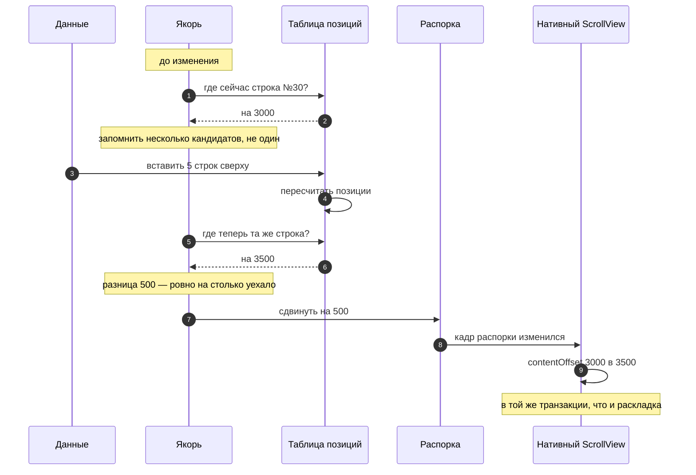
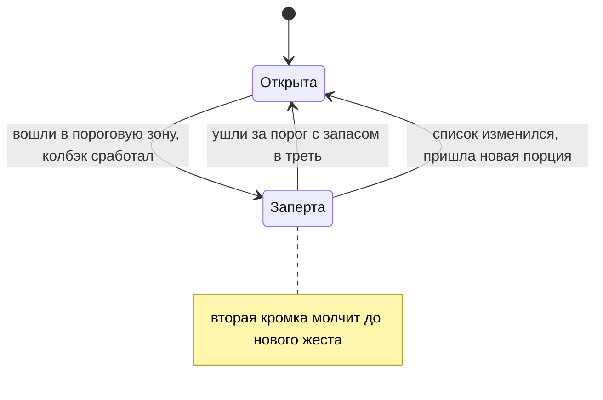
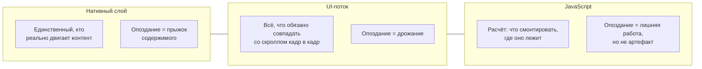
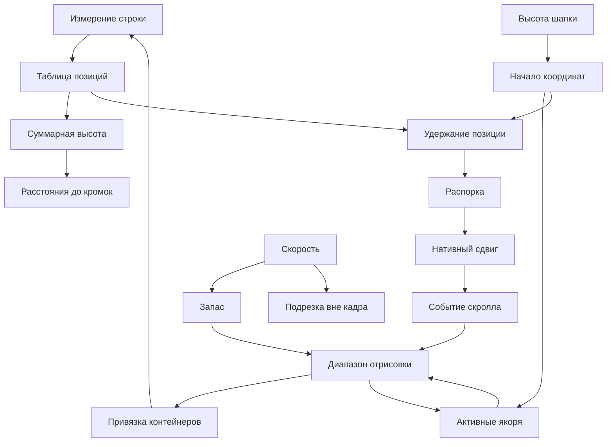

# Механика: как это работает

Разбор устройства списка от простого к сложному: что нарисовано на экране, откуда
берутся позиции строк, что происходит при скролле и как список удерживает видимую
строку на месте, когда всё вокруг неё меняется.

Кода нет — только схемы и числа.

---

## 1. Что на самом деле нарисовано

Внутри списка — обычный `ScrollView`, и лежит в нём вот что:

```
┌─ ScrollView ──────────────────────────────────────────┐
│                                                        │
│  ▪ распорка компенсации   высота 0, уведена за контент │
│                                                        │
│  ┌──────────────────────────────────────────────────┐  │
│  │ шапка                          ListHeaderComponent│  │
│  └──────────────────────────────────────────────────┘  │
│                                                        │
│  ┌─ слой контейнеров ───────── высота = сумма высот ─┐  │
│  │                                                   │  │
│  │   ┌─ контейнер #0 ─┐  absolute, top: 1200         │  │
│  │   └────────────────┘                              │  │
│  │   ┌─ контейнер #1 ─┐  absolute, top: 1284         │  │
│  │   └────────────────┘                              │  │
│  │   ┌─ контейнер #2 ─┐  absolute, top: 1404         │  │
│  │   └────────────────┘                              │  │
│  │        … всего 15–20 штук                         │  │
│  └───────────────────────────────────────────────────┘  │
│                                                        │
│  ┌──────────────────────────────────────────────────┐  │
│  │ подвал                         ListFooterComponent│  │
│  └──────────────────────────────────────────────────┘  │
│                                                        │
│  ▪ распорка нижнего отступа            высота insetEnd │
└────────────────────────────────────────────────────────┘
```

Два момента, и оба неочевидны.

**Строк в дереве нет.** Есть контейнеры, и их полтора-два десятка — столько,
сколько помещается в видимую часть плюс запас. Список из десяти тысяч сообщений и
список из ста выглядят в дереве одинаково.

**Полосу прокрутки создаёт высота слоя.** Слой контейнеров объявляет высоту,
равную сумме высот всех строк — скажем, 900 000 точек. Нативный скролл видит
контент такого размера и позволяет прокрутить его целиком, хотя нарисовано внутри
почти ничего. Контейнеры лежат в этом слое абсолютно и в потоке не участвуют:
сдвиг одного не пересчитывает раскладку остальных.

**Контейнер переживает смену строки.** Когда строка уходит за пределы запаса, её
контейнер не размонтируется — он получает данные другой строки. Для React это
смена пропов, а не пересоздание поддерева. Свободный контейнер выбирается по типу
строки: тот, что рисовал сообщение, уже держит готовое поддерево под сообщение, и
React меняет в нём текст вместо того, чтобы строить всё заново.

---

## 2. Откуда берутся позиции

Позиция строки — это сумма высот всех строк выше неё.

```
строка:    0        1          2      3        4
высота:   84       120        56     92       84
          ├────────┼──────────┼──────┼────────┼────▶
позиция:  0        84        204    260      352
```

Считать эту сумму заново на каждое обращение значило бы проходить весь список на
каждый кадр скролла. Поэтому суммы накапливаются заранее, а пересчитываются
**лениво**: только до запрошенного индекса и только начиная с того места, где
что-то изменилось. Измерения прилетают около видимой части, позиции спрашивают там
же — значит одно измерение стоит десятка сложений, а не длины списка. Хвост
досчитается, когда до него дойдёт скролл.

### Пока строка не измерена

Настоящая высота известна только после того, как строка нарисована. До этого в
таблице стоит **оценка** — средний измеренный размер строк того же типа.

Среднее уточняется с каждым замером, но **замирает после 32 замеров**. Причина не
в точности, а в устойчивости: точнее оно уже не станет, а меняться не перестанет —
и каждое изменение переставляло бы разом все ещё не измеренные строки. Суммарная
высота гуляла бы на сотни точек, а между строками то появлялась, то пропадала бы
полоса. По той же причине оценка, однажды выданная конкретной строке, задним
числом не меняется.

---

## 3. Что происходит при скролле

Пользователь ведёт пальцем, смещение меняется с 3000 до 3024.


Разберём шаги, которые неочевидны.

**Смещение пишется до всяких проверок.** Отсюда его читают прилипание и всё, что
должно двигаться кадр в кадр.

**Расстояния до кромок считаются там же.** «До начала 3000», «до конца 897 000»,
«близко к концу — нет». Это арифметика из смещения и размеров контента, и делается
она на месте, покадрово.

**Порог перехода в JS — по пути, а не по времени.** Двадцать четыре точки
(`scrollThrottleDistance`). У самых кромок контента порог не применяется:
«упёрлись» считается с точностью до пикселя.

**Диапазон — это видимая часть плюс запас по 400 точек в каждую сторону.** По
таблице позиций находятся индексы: скажем, строки 28…44.

**Сигнал адресный.** Контейнер, у которого ничего не изменилось, не
перерисовывается вовсе.

### Почему запас, и почему он дышит

```
        ┌─────────────────────────────┐
        │  запас 400 — уже смонтирован│  строки успевают измериться
        ├─────────────────────────────┤
        │                             │
        │    В И Д И М А Я  Ч А С Т Ь │
        │                             │
        ├─────────────────────────────┤
        │  запас 400 + скорость × 220мс│  на броске растёт вперёд
        └─────────────────────────────┘
```

Запас нужен не для скорости, а чтобы строка успела **быть измеренной до того, как
её увидят**. Без него строка монтируется ровно в момент появления и успевает
мелькнуть сначала оценочной высотой, потом настоящей.

На броске фиксированного запаса мало: пока событие дойдёт до расчёта, а новые
строки отрисуются и смонтируются, контент уезжает дальше запаса — и в кадре
остаётся пустая полоса. Поэтому по ходу движения запас растёт со скоростью:
примерно на пятую долю секунды пути вперёд, с потолком в полтора экрана. Назад он
не растёт — позади всё уже отрисовано.

А выше некоторой скорости запас **снимается совсем**. Есть предел, за которым он
перестаёт окупаться: смонтировать за проход список успевает меньше, чем контент
проходит за то же время. Тогда проход становится втрое дешевле, и на экране
оказывается то, куда пользователь смотрит сейчас, а не то, мимо чего пролетел.

---

## 4. Что происходит, когда строка измерилась

Строка нарисовалась, и оказалось, что её настоящая высота 140, а в таблице стояла
оценка 92.



**Высота читается у узла, а не берётся из события.** Событие раскладки служит лишь
поводом посмотреть: оно может прийти с геометрией, посчитанной до смены
содержимого, а узел читается таким, какой он сейчас.

**Пересчёт откладывается до конца кадра.** При первом наполнении измерения
приходят десятками подряд, и полный проход на каждое стоил бы столько же проходов.

### Новая строка не занимает места

Когда в данных появляется строка, которой раньше не было, её высота неизвестна, а
поставить её нужно уже в этом кадре. Отвести ей оценку нельзя: отведённое место
разойдётся с нарисованным, и на стыке мелькнёт полоса или наложение.

```
        обычная строка              новая, ещё не измеренная
    ┌───────────────────┐         ┌───────────────────┐
    │ слот = 92         │         │ слот = 0          │  раскладка не меняется
    │ нарисовано 92     │         └───────────────────┘
    └───────────────────┘
                                   а нарисована она вот здесь:
                                   ┌───────────────────┐
                                   │ позиция −100 000  │  туда скролл не доходит
                                   │ натуральная высота│  измеряем и ставим на место
                                   └───────────────────┘
```

Так делается не с любой пачкой. Если разом появилось больше 32 строк, они идут по
средним оценкам: смонтировать страницу истории целиком ради измерения дороже, чем
полоса на один кадр, ради которой всё затевалось.

### Строка вне кадра закрыта своими границами

Контейнер, полностью выехавший за видимую часть, получает жёсткую высоту по
отведённому месту и обрезает всё, что за неё выходит. Это защита от того же
расхождения: строка, выросшая за кадром, своим низом въехала бы поверх видимых.

Пока список движется, обрезка снимается с запасом в половину буфера — на броске
строка попадает в кадр раньше расчёта, и подрезанной её было бы видно. Как только
список встал, запас убирается: въезжать в кадр нечему, а вырасти за кадром строка
вполне может. Остановку список определяет по тишине — событий не было дольше
120 мс.

Строка **в** кадре не подрезается никогда: обрезанное содержимое заметнее любого
наложения, а тень или выступающий элемент рисуются за границами строки законно.

---

## 5. Удержание позиции — главное

Механика, ради которой список и написан. Разберём на числах.

### Что должно произойти

Пользователь читает переписку, смотрит на сообщение №30. Смещение скролла — 3000.
Сверху подгрузилась страница истории: пять сообщений по 100 точек.

```
   ДО ВСТАВКИ            БЕЗ КОМПЕНСАЦИИ         С КОМПЕНСАЦИЕЙ
                          позиции +500            позиции +500
                                                  скролл 3000 → 3500

  ┌──────────────┐      ┌──────────────┐        ┌──────────────┐
  │ сообщение 28 │      │ новое 4      │        │ сообщение 28 │
  │ сообщение 29 │      │ новое 5      │        │ сообщение 29 │
▶ │ сообщение 30 │    ▶ │ сообщение 26 │      ▶ │ сообщение 30 │
  │ сообщение 31 │      │ сообщение 27 │        │ сообщение 31 │
  └──────────────┘      └──────────────┘        └──────────────┘
     смотрим сюда        всё уехало вниз          ничего не сдвинулось
                         на пол-экрана
```

Все позиции ниже вставки выросли на 500. Значит скролл нужно подвинуть на те же
500. Вопрос в том, **как именно** его двигать.

### Почему не программный скролл

Очевидное решение — посчитать 500 и вызвать скролл к новому смещению. Оно не
работает по трём причинам:

- **прыжок.** Скролл придёт отдельным кадром, уже после того, как раскладка
  изменилась. Между двумя кадрами содержимое стоит на новом месте, а скролл — на
  старом, и это видно;
- **обрыв жеста.** Программный скролл останавливает палец и инерцию: список,
  который в этот момент листают, дёргается и замирает;
- **гонка.** Порядок «сначала раскладка, потом скролл» ничем не гарантирован.

### Как сделано

Первым ребёнком контента лежит **распорка нулевого размера**, уведённая далеко за
пределы контента. Нативному `ScrollView` включено его собственное удержание
видимой позиции: он запоминает кадр этой распорки перед транзакцией изменений и
после неё добавляет смещение кадра к `contentOffset`.

То есть **чтобы подвинуть скролл, список двигает распорку.** Нативный слой делает
сдвиг в той же транзакции, что и саму раскладку: промежуточного кадра не возникает
в принципе, а жест не прерывается — с точки зрения нативного скролла ничего
постороннего не произошло.

Величина в распорке **накопительная**, а не разовая: нативный слой смотрит на
смещение кадра между транзакциями, и сброс в ноль был бы обратным сдвигом на всю
накопленную сумму.

### Полная последовательность



**Якорей запоминается несколько, а не один.** Первая видимая строка вполне может
не пережить то самое изменение, ради которого якорь и снимался: спиннер загрузки
наверху исчезает ровно тогда, когда приходит подгруженная порция.

Предпочтение — строкам, целиком лежащим ниже верхней кромки. Строка, торчащая над
кромкой, видна лишь частью и своим размером тянет за собой всё, что под ней:
изменись она — и удержанным окажется её верх, а весь видимый контент уедет.

**Считается разница позиций, а не расстояние до кромки экрана.** Между снятием
якоря и пересчётом проходит кадр, и за этот кадр пользователь успевает
проскроллить. Расстояние до кромки изменится вместе со скроллом, и собственное
движение пользователя попало бы в компенсацию вторым разом. Разница позиций от
скролла не зависит вовсе.

### Три поправки, каждая из которых была отдельной ошибкой

**Двойная компенсация у конца.** Когда контент стал короче, `ScrollView` сам
подтягивает смещение к новой границе — часть работы уже сделана без нас. Считать её
своей значит сделать её дважды, и экран уезжает вдвое.

**Упор в границы.** Опустить якорь на прежнее место экрана бывает нечем — контента
под ним не хватает. Тогда сдвиг обрезается по границе, а накопленный остаток
сбрасывается: доводить у границы уже нечего.

**Потеря долей точки.** Нативный слой принимает только целые точки, а строки
растут на дробные величины. Без накопления остатка каждый такой рост молча
терялся бы, и за десяток обновлений экран уезжал бы заметно.

### Очередь неподтверждённых сдвигов

Между записью распорки и правкой `contentOffset` проходит транзакция, и события
скролла, отправленные до неё, несут прежнее смещение.

```
время ──────────────────────────────────────────────▶

  распорка +500 ──┐
                  │   ┌── событие «я на 3000»  ← устарело, принимать нельзя
                  ▼   │
            транзакция│
                  │   │
                  ▼   ▼
       contentOffset 3500 ── событие «я на 3500»  ← вот это подтверждает сдвиг
```

Принять устаревшее — значит откатить только что сделанный сдвиг и на следующем
проходе сделать его снова: на экране это дрожание и мигание ячеек у кромок.
Поэтому применённые сдвиги стоят в очереди и снимаются с неё по мере того, как
приходят события с подходящими позициями. Сдвигов подряд бывает несколько —
вставка двигает по оценкам, а следующий кадр уточняет их измерением, — и нативный
слой применяет их по одному.

---

## 6. Прилипание

Заголовок даты, который останавливается у верхней кромки и держится там, пока его
не вытолкнет следующий. Аватар группы, который стоит у нижней кромки, пока видна
хоть часть группы.

**Строка при этом остаётся на своём месте в контенте** — её, как и все остальные,
везёт нативный скролл. Прилипание добавляет ей смещение, компенсирующее уехавший
скролл. Считается оно на UI-потоке, в такт скроллу: опоздание здесь видно как
дрожание.

### Три состояния, и движение есть только в одном

```
   1. НЕ ДОЕХАЛ            2. У КРОМКИ             3. ВЫТОЛКНУТ
                                                      следующим

  ┌─────────────┐        ┌═════════════┐        ┌─────────────┐
  │             │        ║ 14 сентября ║ ◀─ кромка ┌───────────┐
  │             │        └═════════════┘        │ │15 сентября│ ◀─ кромка
  │ 14 сентября │        │             │        │ └───────────┘
  │             │        │             │        └─────────────┘
  └─────────────┘

  смещение = 0           смещение растёт        смещение упёрлось
  едет с контентом       компенсирует скролл    едет с контентом
                         п о к а д р о в о
```

В первом и третьем состоянии трансформ постоянен, и элемент везёт нативный скролл.
Покадровая работа есть только во втором.

**Предел** — точка, где текущий якорь уступает место соседнему. Без него все якоря
набора липли бы к кромке наравне и накладывались друг на друга. Считается он из
геометрии соседей и от позиции скролла не зависит — иначе менялся бы на каждом
кадре и гонял бы пересчёт.

### Слой копий поверх списка

Пока элемент стоит у кромки, его рисует отдельный слой **снаружи** прокручиваемой
области:

```
┌─ экран ────────────────────────┐
│ ┌────────────────────────────┐ │
│ │ 14 сентября                │ │ ◀── слой поверх: не двигается вовсе
│ └────────────────────────────┘ │
│ ┌─ ScrollView ───────────────┐ │
│ │  ░░ 14 сентября ░░         │ │ ◀── копия внутри контента: спрятана,
│ │  сообщение                 │ │     но место для касаний осталось
│ │  сообщение                 │ │
│ └────────────────────────────┘ │
└────────────────────────────────┘
```

Смысл в том, что снаружи элемент вообще не двигается: нет покадрового смещения —
нечему отставать и нечему дрожать.

**Прилипший элемент нельзя размонтировать.** Он виден у кромки, когда его группа
давно ушла за пределы запаса, и обычный диапазон отпустил бы его контейнер — на
экране прилипшая шапка просто исчезла бы. Поэтому активные якоря удерживаются
смонтированными отдельно от диапазона. Соседи по набору тоже: следующий якорь
подъезжает снизу и выталкивает текущий, и делать это ему нужно уже смонтированным.

**Порядок наложения задан ролью, а не номером контейнера.** Номера раздаёт пул, и
если бы порядок зависел от них, какая строка окажется поверх какой решал бы случай.

### Про координаты

Позиции строк отсчитываются от начала элементов, а смещение скролла приходит от
начала контента — над элементами лежит шапка списка. Разница равна её высоте, и
всё, что переводит одно в другое, обязано её снимать. Без этого якорь встаёт ниже
кромки ровно на высоту шапки.

---

## 7. Подгрузка

Колбэк подгрузки обязан сработать один раз на вход в пороговую зону. Событий
скролла в этой зоне десятки в секунду.



**Защёлка отпирается с запасом.** Не ровно за порогом, а примерно в трети за ним:
без запаса достаточно дрогнуть на границе, чтобы подгрузка ушла повторно.

**Но повторяется, пока нужно.** Если порция пришла, а до кромки по-прежнему
близко, ждать выхода бессмысленно — нужна следующая. Защёлка снимается досрочно,
когда список реально изменился: выросла высота контента или число элементов.

**Общий замок на обе кромки.** На коротком контенте начало и конец одновременно
оказываются в пороговой зоне, и подгрузка вверх и вниз выстреливают вместе.
Пользователь при этом двигался в одну сторону — направление жеста и решает, какая
кромка разблокируется.

**Распорка не считается контентом.** Отступ у конца — зарезервированное место, а не
непрочитанные сообщения; иначе подгрузка срабатывала бы на пустом месте.

**Программное движение не считается движением пользователя.** Переезд к концу по
кнопке иначе немедленно запускал бы подгрузку.

---

## 8. Стартовая позиция

Открыть список сразу на нужном сообщении сложнее, чем кажется: позиция цели
считается по таблице, а до измерения ячеек таблица оценочная. Значит цель уезжает
после каждого кадра измерений.

```
попытка 1   цель на 4200   доскроллили   ▸ измерения пришли, цель уехала на 4460
попытка 2   цель на 4460   доскроллили   ▸ цель уехала на 4510
попытка 3   цель на 4510   доскроллили   ▸ цель не сдвинулась
                                          ▸ показываем список
```

До этого момента список не показан вовсе — иначе видно, как он доводится на
глазах. Попыток не больше десяти; если размеры так и не устаканились, список
показывается на той позиции, до которой дошёл.

Тот же механизм отвечает за первый показ вообще: список раскрывается, когда
видимые строки измерены — или когда их размеры объявлены пропом и измерять нечего.
На случай, когда измерений не приходит вовсе (нулевая высота ячеек), есть
страховка по времени.

---

## 9. Распорки и прилипание к концу

**Новое сообщение должно оказаться на экране само.** Скролл к концу откладывается
на кадр: к этому моменту новый контент уже разложен и его высота известна. Если за
это время пользователь увёл список руками — прилипание отменяется, жест главнее.
Отличить одно от другого просто: палец за кадр сдвигает список на единицы точек, а
рост контента снизу смещение не меняет вовсе.

```
  alignItemsAtEnd            anchoredEndSpace

┌──────────────┐          ┌──────────────┐
│░░ распорка ░░│          │ цитата       │ ◀─ поднялась к верхней кромке
│░░░░░░░░░░░░░░│          │ сообщение    │
├──────────────┤          │ сообщение    │
│ сообщение 1  │          ├──────────────┤
│ сообщение 2  │          │░░ распорка ░░│ ◀─ места под ней не хватало,
└──────────────┘          └──────────────┘    добрали распоркой

короткий контент          переход к цитате
прижат к низу             у самого конца
```

Обе распорки решают одну и ту же задачу — «контента не хватает», — но с разных
концов.

---

## 10. Видимость элементов

«Элемент виден» — не одно условие, а два разных, и выбор зависит от размера ячейки.

```
   обычная строка                 крупная карточка

┌─ экран ──────────┐          ┌─ экран ──────────┐
│                  │          │▓▓▓▓▓▓▓▓▓▓▓▓▓▓▓▓▓▓│
│  ▓▓▓▓▓▓▓▓▓▓▓▓▓▓  │          │▓▓▓▓▓▓▓▓▓▓▓▓▓▓▓▓▓▓│
│  ▓▓ 60% строки ▓ │          │▓▓ 100% экрана ▓▓▓│
└──────────────────┘          └──────────────────┘
   ▓▓▓▓▓▓▓▓▓▓▓▓▓▓                ▓▓▓▓▓▓▓▓▓▓▓▓▓▓▓▓
                                 ▓▓▓▓▓▓▓▓▓▓▓▓▓▓▓▓

 доля самого элемента          доля занятого экрана
 itemVisiblePercentThreshold   viewAreaCoveragePercentThreshold
```

Для карточки, не помещающейся в экран целиком, первый порог недостижим в принципе —
поэтому есть второй.

Наружу уходят только изменения набора, а не состояние на каждом кадре. Выдержка
времени отсекает элементы, мелькнувшие при быстром скролле: если элемент ушёл
раньше, чем выдержка истекла, таймер снимается и колбэка не будет.

Каждая пара «условие — колбэк» ведётся отдельно: один и тот же элемент может быть
видимым по одному порогу и невидимым по другому.

---

## 11. Отступы и клавиатура

До низа экрана дотягиваются четверо, и каждый считает отступ по-своему:

```
┌─ экран ─────────────────┐
│                         │
│   сообщения             │  ① контент обязан кончиться здесь
│                         │  ② скролл обязан подняться вместе с клавиатурой
├─────────────────────────┤  ③ индикатор прокрутки живёт в своих координатах
│   панель ввода          │  ④ прилипший якорь нижней кромки встаёт сюда
├─────────────────────────┤
│                         │
│   клавиатура            │
│                         │
└─────────────────────────┘
```

Если хоть один считает отступ отдельно, расхождение видно глазом. Поэтому величина
заводится **одна** и раздаётся всем.

Перекрытие снизу — это **максимум** из клавиатуры и безопасной зоны, а не сумма:
открытая клавиатура сама закрывает домашний индикатор.

Место под панелью ввода отдаётся распоркой в конце контента — она часть контента,
поэтому последняя строка честно останавливается над панелью. Но одной распорки
мало: она добавляется в конец, а удержание позиции компенсирует только изменения
выше экрана — видимые строки от неё не двигаются.

Поднимают контент двое, и правило у них одно: **низ контента стоит на верхней
кромке панели.** Пока контента меньше экрана, поднимает сдвиг выравнивания —
прокручивать в таком списке нечего. Когда больше — смещение скролла, сдвинутое
явно и на UI-потоке. На границе они делят подъём: сдвиг доезжает до нуля, остаток
добирает скролл. Обе величины считаются в одном кадре из одного и того же
отступа, поэтому в сумме дают ровно его прирост.

Конец контента при этом считается сам: замер `contentSize` придёт только
следующим кадром, и список подставляет вместо вошедшей в него распорки текущую.
Иначе у самого низа списка сдвиг упрётся в ещё не выросшую границу скролла и
обрежется — компенсация пропадёт ровно там, где нужнее всего.

---

## 12. Два канала наружу

Одни и те же величины отдаются двумя способами, и разница между ними — цена.

| Значения | На UI-поток | В React |
| --- | --- | --- |
| Смещение, фазы жеста | каждый кадр | — |
| Расстояния и флаги кромок | каждый кадр | шагами по 24 точки |
| Размеры, распорки | на раскладке | на раскладке |
| Скорость, видимый диапазон, якоря | шагами | шагами |
| Цена обновления | ноль рендеров | рендер у подписчика |

Расстояния и флаги считаются прямо на UI-потоке из смещения и геометрии — поэтому
на них можно строить непрерывное движение: тень под навбаром, свой скроллбар,
кнопку «вниз».

Видимый диапазон и активные якоря непрерывными быть не могут в принципе: их не
получить без прохода по таблице позиций.

Подписка в React **адресная** — на одно имя значения. Изменение будит только того,
кто именно его и читал, а запись, не изменившая значение, не будит никого. Тот же
приём лежит в основе всей связи расчёта с деревом: контейнер узнаёт о своём
содержимом не через общий объект состояния, а через сигналы своего номера.

---

## Три плоскости

Теперь, когда механики разобраны, видно общее правило. Список живёт в трёх местах,
и почти каждое решение — это ответ на вопрос, в каком из трёх должно происходить
очередное действие.



Критерий один: **что увидит пользователь, если это опоздает на кадр.** Дрожание —
значит на UI-поток. Лишний рендер — значит в JS. Прыжок содержимого — значит вообще
не в наших руках, надо отдавать нативному слою.

---

## Как это связано между собой

Механики опираются друг на друга, и почти каждая цепочка начинается с измерения.



**Круг компенсации замкнут** — и поэтому в нём стоят две защиты: очередь
неподтверждённых сдвигов не даёт принять устаревшее событие, а признак
программного движения не даёт кругу запустить подгрузку.

**Прилипание тоже возвращается во вход виртуализации**: активные якоря выбираются
по текущей позиции, но обязаны остаться смонтированными вне запаса. Туда же
попадают строки, ждущие первого измерения — их слот схлопнут в ноль, и сами в
диапазон они не попадут.

**Скорость через две ступени управляет тем, увидит ли пользователь наложение** при
росте строки: она задаёт запас, а факт движения решает, подрезаны ли строки за
кадром.

---

## Порядок — тоже часть механики

Внутри одного прохода последовательность вызовов сама по себе является поведением,
и её перестановка ломает вещи, которые не всегда видны тестами.

Якорь снимается **до** смены данных и восстанавливается **после**: он обязан
помнить раскладку такой, какой она была до изменения.

Флаг, прочитанный после того, как контент вырос, отвечает уже на другой вопрос.
Если решение зависит от того, где был пользователь, значение снимается **до**
применения изменений.

Расчёт диапазона идёт по **живому** смещению UI-потока, а не по тому, что сейчас
обрабатывает JS: на быстром движении событие успевает устареть на несколько
экранов, и строки смонтировались бы туда, где пользователя уже нет.

События скролла сливаются в один проход на кадр: нативный слой шлёт их чаще, чем JS
успевает отрисовать кадр, и лишний проход — это работа, которую никто не увидит. Но
у самой кромки слияние снимается: «упёрлись» считается с точностью до пикселя.

---

## Дальше

- [Архитектура](architecture.md) — те же механики, но по модулям и с порядком вызовов
- [Удержание позиции](maintain-position.md) — главная механика с настройками и рецептами
- [Производительность](performance.md) — какие из этих механик чем платят
- [Ограничения](limitations.md) — чего этими средствами сделать нельзя
